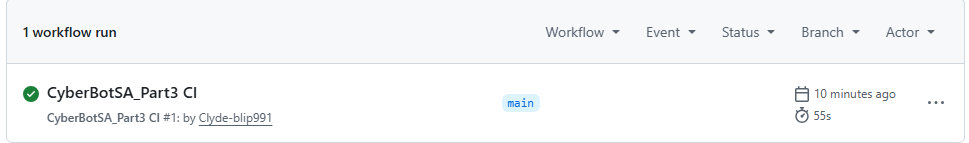

CyberBotSA Part 3 - Advanced Cybersecurity Awareness Chatbot

Description
A WPF C# application that extends the CyberBotSA chatbot with advanced features including a task assistant with MySQL database storage, cybersecurity quiz, NLP simulation and activity log.

 Features
- Task Assistant with MySQL database storage
- Cybersecurity Mini Game Quiz with 11 questions
- NLP Simulation for natural language understanding
- Activity Log tracking all chatbot actions
- Sentiment detection from Part 2
- Memory and recall from Part 2
- Voice greeting from Part 1

 How to Run
1. Make sure MySQL is installed and running
2. Create database: CREATE DATABASE cyberbotsa;
3. Open CyberBotSA_part2 in Visual Studio 2022
4. Press F5 to run

CI Workflow Screenshot

